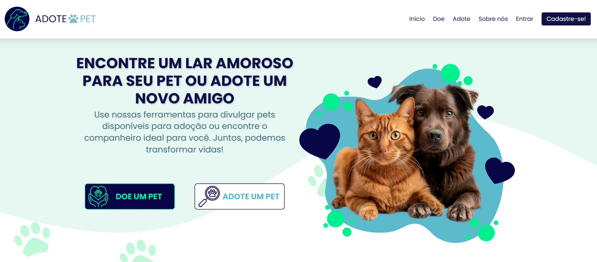

<h1 align="center">
  🐾 Adote Pet
</h1>

  
   
  🐱<em>Tela principal do sistema Adote Pet</em>🐶

  
   
  🐱<em>Tela principal do sistema Adote Pet</em>🐶

  
  
  
  
  

---

## 💡 Sobre o Projeto

> **Adote Pet** é um sistema web desenvolvido como **Trabalho de Conclusão de Curso - TCC**, com o objetivo de unir tecnologia, design e propósito social. A plataforma incentiva a **adoção responsável de animais em situação de vulnerabilidade**, oferecendo uma experiência acolhedora, moderna e funcional tanto para tutores quanto para colaboradores.

---

## 🧠 Funcionalidades

- 🐶 **Listagem de pets com fotos, porte, idade e características**
- ❤️ **Favoritar animais** para facilitar futuras adoções
- 📝 **Formulário de adoção simples e eficaz**
- 🧑‍💻 **Perfis personalizados para tutores e colaboradores**
- 📊 **Dashboard administrativo com métricas em tempo real**
- 🔒 **Autenticação segura com login e logout**
- ✅ **Aprovação de doações e permissões administrativas**
- 📚 **Mensagens educativas sobre adoção e cuidados com pets**

---

## 📷 Visualização do Projeto

  
🖼️ Clique aqui para visualizar as telas do sistema..

  
  
  
  
  
  

<h4 align="right">

[Voltar](#-visualização-do-projeto)

</h4>

---

## 🎨 Design e Experiência

- Layout responsivo e amigável 🌸
- Paleta de cores que transmite empatia e confiança 💗
- Interface intuitiva, desenvolvida pensando na **acessibilidade e usabilidade**

---

## 🛠️ Tecnologias Utilizadas

- **PHP** + MySQL
- HTML5 + CSS3 + JavaScript
- Arquitetura MVC (Model-View-Controller)
- Sistema local com **XAMPP**

---

## 👩‍🎓 Autoria

> Desenvolvido com 💛 por **Angel Luz**.
- 🎓 **Projeto de Conclusão de Curso - TCC**
- 📘 Curso: **Técnico Informática**
- 🏫 Instituição: **ETB - Escola Técnica de Brasília**

Se quiser conversar, colaborar ou oferecer uma oportunidade:

📬 E-mail: [contatoangelluz@gmail.com](mailto:contatoangelluz@gmail.com)  
🐙 GitHub: [@angelluzk](https://github.com/angelluzk)  
💼 LinkedIn: [linkedin.com/in/angelitaluz](https://www.linkedin.com/in/angelitaluz/)  
🗂️Website / Portfólio: [meu_portfolio/](https://angelluzk.github.io/meu_portfolio/) 

Se quiser conversar, colaborar ou oferecer uma oportunidade:

📬 E-mail: [contatoangelluz@gmail.com](mailto:contatoangelluz@gmail.com)  
🐙 GitHub: [@angelluzk](https://github.com/angelluzk)  
💼 LinkedIn: [linkedin.com/in/angelitaluz](https://www.linkedin.com/in/angelitaluz/)  
🗂️Website / Portfólio: [meu_portfolio/](https://angelluzk.github.io/meu_portfolio/) 

---
